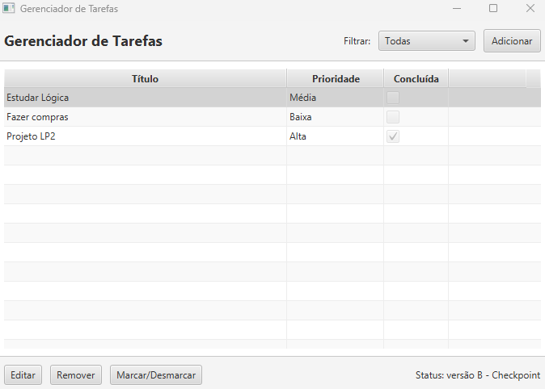
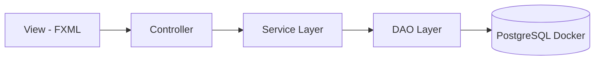

# 📝 Gerenciador de Tarefas Pessoais (JavaFX + Docker)


> **Solução Desktop de Alta Produtividade**
>
> Sistema de gerenciamento de tarefas robusto com **persistência de dados automatizada** via containers. O foco do projeto foi criar uma experiência "Zero Config" para o usuário final, onde a aplicação gerencia sua própria infraestrutura de banco de dados.

## 📸 Demonstração


---

## 👨‍💻 Desenvolvedor
**Julio Edson Anastácio Rêgo**
* [LinkedIn](https://www.linkedin.com/in/edson-anastacio-dev/)
* [GitHub](https://github.com/Edson-Anastacio)

---

## 🚀 Diferenciais Técnicos

Este não é apenas um CRUD simples. O sistema foi projetado com conceitos de **DevOps embarcado**:

* ✅ **Auto-Bootstrap Docker:** Ao iniciar, a aplicação Java detecta se o ambiente Docker está rodando, baixa a imagem do PostgreSQL e sobe o container automaticamente via `ProcessBuilder`.
* ✅ **Arquitetura em Camadas:** Separação estrita entre Interface (View), Regra de Negócio (Service) e Acesso a Dados (DAO).
* ✅ **Persistência Real:** Nada de dados em memória. Tudo é transacional no PostgreSQL.

---

## 🛠 Stack Tecnológica

* **Linguagem:** Java 21 LTS
* **Interface:** JavaFX 23 (Modular)
* **Banco de Dados:** PostgreSQL 16 (Containerizado)
* **Build Tool:** Apache Maven
* **Infraestrutura:** Docker & Docker API
---

## ⚙️ Funcionalidades

O sistema implementa um CRUD completo com infraestrutura automatizada:

* ✅ **Auto-Bootstrap:** O sistema verifica, baixa e inicia o container do Docker automaticamente ao abrir.
* ✅ **Persistência Real:** As tarefas são salvas no PostgreSQL.
* ➕ **Adicionar Tarefa:** Criação de novas tarefas com Título, Descrição e Prioridade.
* ✏️ **Editar Tarefa:** Alteração de dados com atualização imediata no banco de dados.
* 🗑️ **Remover Tarefa:** Exclusão definitiva do registro no banco.
* ✔️ **Status:** Checkbox interativo que salva o estado (pendente/concluída).
* 🔍 **Filtros Dinâmicos:** Filtragem visual (Todas / Ativas / Concluídas).

---

## 🏗️ Arquitetura (MVC + DAO)

O projeto segue padrões de design para garantir manutenibilidade:


* **Model**: Representação de Entidades (```Task```).
* **View**: Interface visual desacoplada (```.fxml```).
* **Controller**: Orquestração de eventos.
* **DAO (Data Access Object)**: Abstração do SQL e gestão de conexões JDBC.
* **DockerService**: Módulo exclusivo para orquestração de containers via código Java.

### 📂 Estrutura de Pastas
```text
src/main/java/com/projeto
│
├── controller      # Controladores da interface (Lógica de Tela)
│   ├── MainController.java
│   └── TaskDialogController.java
│
├── model           # Objetos de Domínio
│   └── Task.java
│
├── service         # Regras de Negócio
│   └── TaskService.java
│
├── DockerService.java # Automação: Gerencia o container Docker
├── TaskDAO.java       # Acesso ao Banco: CRUD + Criação de Tabela
├── Launcher.java      # Ponto de entrada (Inicializa Docker + App)
└── Main.java          # Classe Principal JavaFX
```
---

## 🔮 Roadmap (Progresso)

- [x] Integração com Banco de Dados PostgreSQL via Docker.
- [x] Implementação do Service de Auto-Bootstrap.
- [ ] Refatoração para API REST com **Spring Boot 3.**
- [ ] Migração da Interface para Web (React/Angular).

---

## 🛠️ Como Executar

### 1. Pré-requisitos
* **Java JDK 21** ou superior.
* **Docker Desktop** instalado e em execução.
* **Maven**.

### 2. Executando a Aplicação
Não é necessário configurar o banco de dados manualmente. O sistema fará o provisioning automático.

```bash
# 1. Clone o repositório
git clone https://github.com/Edson-Anastacio/task-manager-api.git

# 2. Entre na pasta
cd task-manager-api

# 3. Execute via Maven
mvn javafx:run
```
## ❓ Solução de Problemas Comuns

**Erro: "Docker não encontrado" ou erro ao iniciar**
> Certifique-se de que o aplicativo **Docker Desktop** está aberto antes de rodar o comando.

**Erro: "Port 5432 is already allocated"**
> Significa que já existe um outro PostgreSQL rodando na sua máquina.
> **Solução:** Pare o serviço local do Postgres ou altere a porta no arquivo `DockerService.java`.
